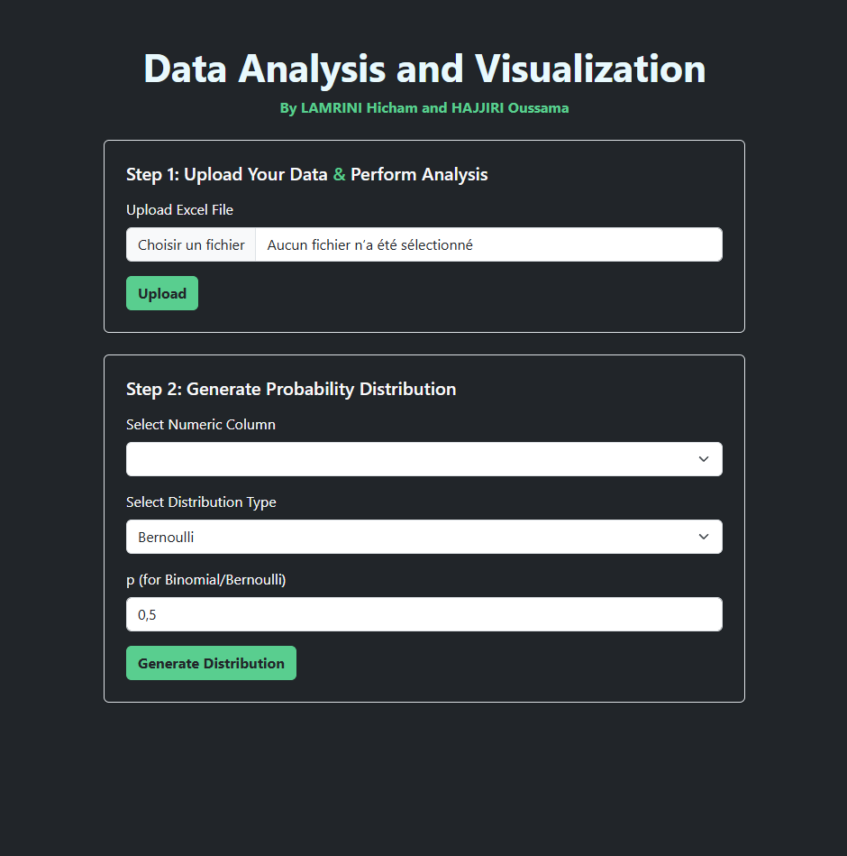
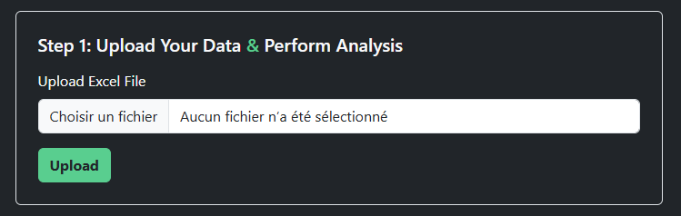
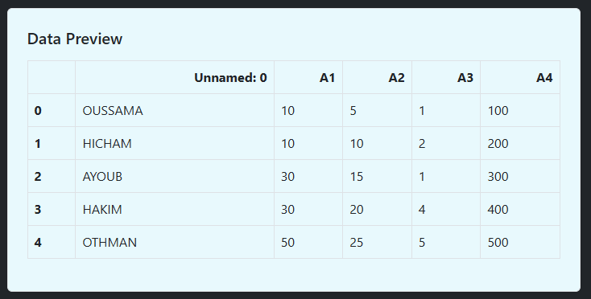
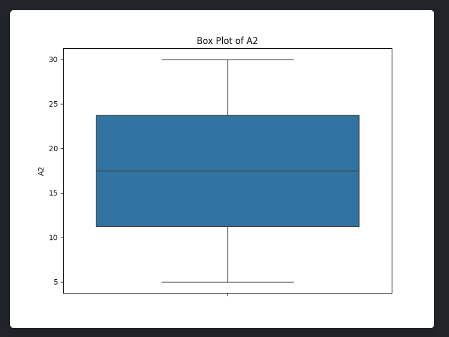
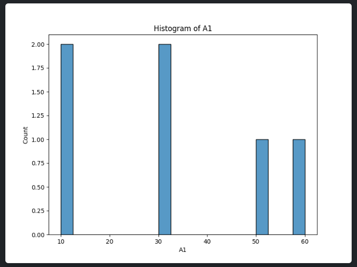
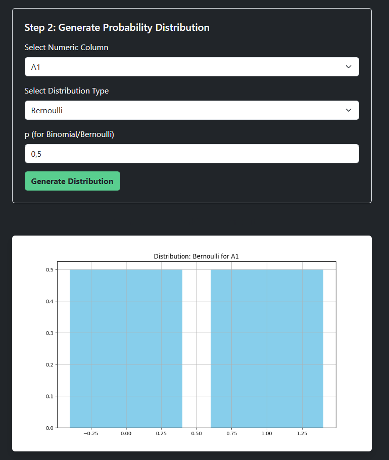

# Data Analysis and Visualization Project

## Overview

This project provides a user-friendly interface for performing data analysis and visualization. Users can upload Excel files, preview the data, compute basic statistics, generate visualizations, and explore probability distributions.

## Features

- Upload and preview Excel data.
- Calculate descriptive statistics (mean, median, mode, etc.).
- Generate various visualizations such as line plots, box plots, histograms, scatter plots, and more.
- Create probability distributions (e.g., Bernoulli, Binomial, Poisson, Uniform, Exponential, Normal).

## Prerequisites

- Python 3.8 or later
- Django 4.0 or later
- Required Python libraries (listed in `requirements.txt`)

## Installation

1. Clone the repository:
   ```bash
   git clone https://github.com/yourusername/data_analysis_project.git
   ```
2. Navigate to the project directory:
   ```bash
   cd data_analysis_project
   ```
3. Create a virtual environment:
   ```bash
   python -m venv venv
   ```
4. Activate the virtual environment:
   ```bash
   \venv\Scripts\activate
   ```
5. Install dependencies:
   ```bash
   pip install -r requirements.txt
   ```

## Running the Application

1. Navigate to the project directory:
   ```bash
   cd data_analysis_project
   ```
2. Run the server:
   ```bash
   python manage.py runserver
   ```
3. Open your browser and go to `http://127.0.0.1:8000` to access the application.

## Testing the Application

You can test the application using the provided test file `Excel_Test_File.xlsx` located inside the project directory. 
1. Launch the application as described above.
2. Upload the test file by selecting `Excel_Test_File.xlsx`.

## Screenshots

Here are some screenshots showcasing the application in action:

1. **Homepage**
   

2. **File Upload**
   

3. **Data Preview**
   

4. **Statistics and Visualizations**
   
   

5. **Probability Distributions**
   

## License

This project is licensed under the MIT License. See the `LICENSE` file for details.

---

### Contributors

- **LAMRINI Hicham**
- **HAJJIRI Oussama**
